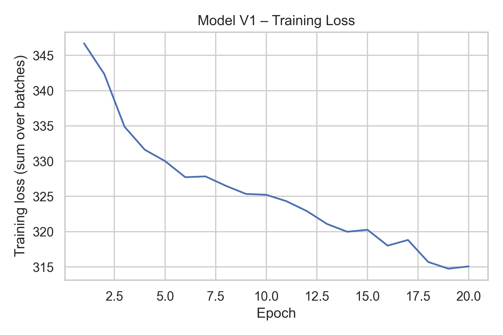
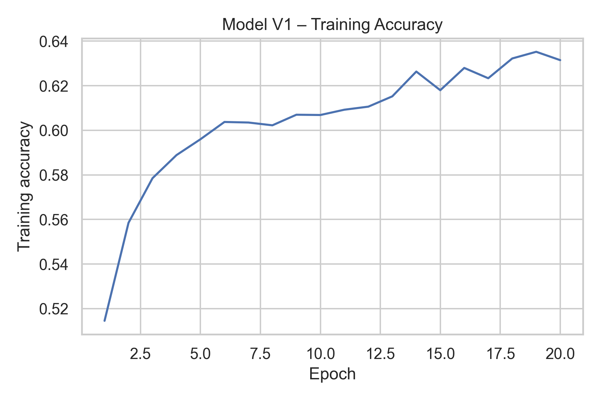
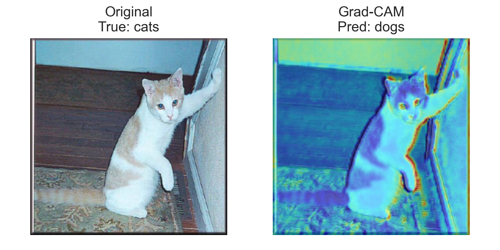
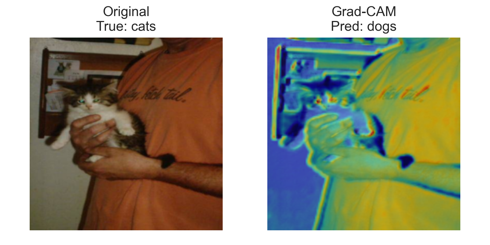
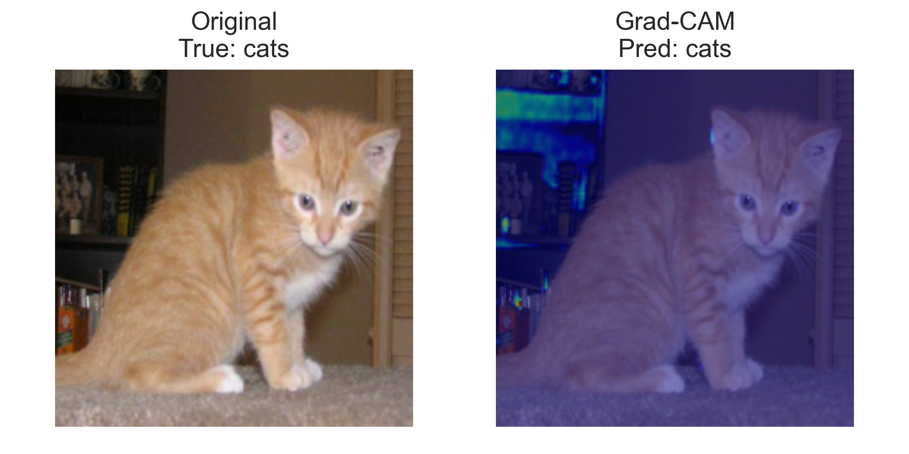
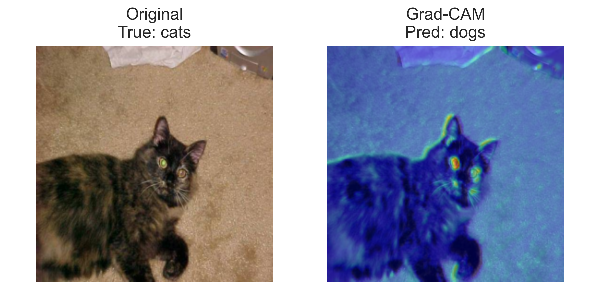
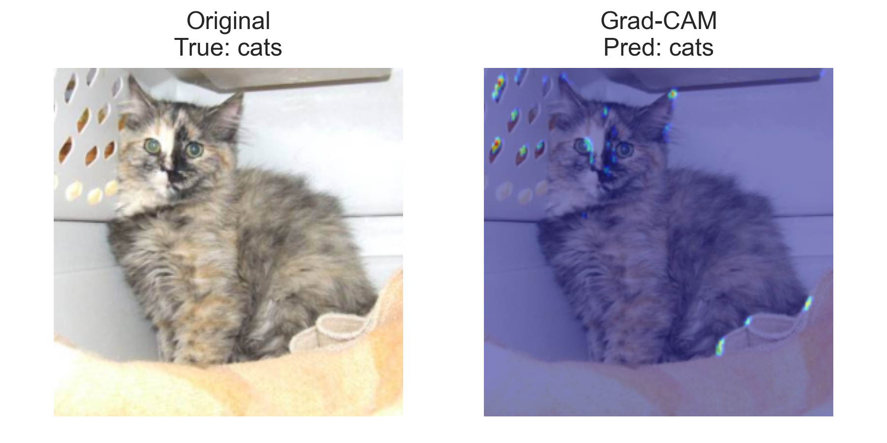
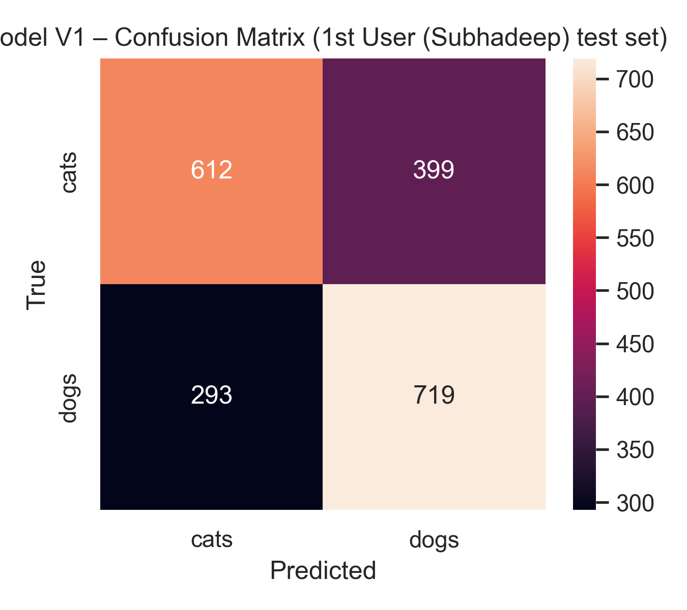

# Cross-Dataset CNN Evaluation for Cats vs Dogs Classification  
### Collaborative Research Project — User1 (Subhadeep) & User2 (Prajjval)

---

## 1. Introduction

This project studies **cross-dataset generalization** in a Cats vs Dogs
classification problem using convolutional neural networks (CNNs).

Two different datasets were used:

- **User 1 (Subhadeep):**  
  TongPython Cats vs Dogs dataset (simple backgrounds, diverse quality)

- **User 2 (Prajjval):**  
  Dogs vs Cats Redux dataset (higher resolution, richer variations)

The objective was to:

1. Train a model separately on each dataset  
2. Test each model on the *other* dataset  
3. Analyze performance drop (domain shift)  
4. Discuss dataset bias, robustness, and generalization  

The work follows a fork-based GitHub collaboration workflow as required.

---

## 2. Dataset Description

### User 1 Dataset (TongPython)
- 25,000 total images  
- Balanced: Cat / Dog  
- Simple backgrounds (indoor, uniform lighting)  
- Medium resolution  
- Less variation in pose and viewpoint  

### User 2 Dataset (Redux)
- 12,500 images used for testing  
- High variation in:
  - lighting  
  - background environments  
  - camera angles  
  - occlusions and shadows  
- Higher image resolution  
- More realistic distribution  

These differences create a **domain shift**, affecting model performance.

---

## 3. Model Architectures

### Model V1 (User 1)
A small CNN:

- 2 convolution layers  
- MaxPool + ReLU  
- AdaptiveAvgPool  
- Fully-connected layers  
- Output: 2 classes  

Designed for simplicity & fast training.

### Model V2 (User 2)
A deeper CNN:

- 3 convolution blocks  
- Batch Normalization  
- Dropout regularization  
- Larger feature maps  
- Fully-connected classifier  

Much more robust to variation in real images.

---

## 4. Training Results (User1 → Model V1)

### 4.1 Loss Curve

### 4.2 Accuracy Curve

Final training accuracy for Model V1:

- **63.15%**

V1 learned basic features but did not fully converge.

---

## 5. Grad-CAM Visualization (Model V1)

Grad-CAM helps understand what V1 looked at during prediction.

Below are 5 samples:

  
  
  
  

### Observations
- Many CAMs highlight **background textures** instead of the animal.
- Some focus on ears or silhouettes → causes cat/dog confusion.
- Dark, cluttered images cause attention drift.
- Indicates overfitting to User1 dataset background patterns.

---

## 6. Confusion Matrix (Model V1 on User1)

Shows misclassification patterns inside User1 dataset.

---

## 7. Cross-Dataset Evaluation

### 7.1 Model V1 → User 1
- Accuracy: **63.15%**

### 7.2 Model V1 → User 2
User2 dataset is unlabeled, so accuracy cannot be computed.  
But distribution of predictions over **12,500** images:

- Dogs (class 1): **6854 (54.83%)**  
- Cats (class 0): **5646 (45.17%)**

Model V1 shows weak generalization — domain shift observed.

---

## 8. Reverse Evaluation (Model V2 → User1)

Model V2 was trained by User2 on Redux dataset.

### **Model V2 → User1 accuracy: 84.23%**  
(Evaluated on 2023 labeled samples)

This is a **very strong generalization result**.

---

## 9. Cross-Dataset Comparison Table

| Model | Train Dataset | Test Dataset | Result | Notes |
|-------|--------------|--------------|--------|-------|
| **V1** | User1 | User1 | 63.15% | Baseline |
| **V1** | User1 | User2 | 6854 dogs, 5646 cats | Cannot compute accuracy |
| **V2** | User2 | User2 | 81.14% | Strong performance |
| **V2** | User2 | User1 | **84.23%** | Excellent generalization |

---

## 10. Analysis: Why V2 Generalizes Better?

1. **User2 dataset is richer and more diverse**  
   — model learns features robust to lighting, pose, camera angle.

2. **Model V2 is architecturally stronger**  
   - BatchNorm  
   - Dropout  
   - More convolution layers  

3. **User1 dataset is simpler**  
   → a robust model (V2) generalizes easily to simpler domains.

4. **Model V1 has lower capacity**  
   → struggles with highly varied images in User2 dataset.

This explains the asymmetry:

- V1 → User2 = **poor**  
- V2 → User1 = **excellent**

---

## 11. Failure Case Analysis

Typical patterns observed:

- Small dogs misclassified as cats (ear shape confusion)
- Backlit animals misclassified due to silhouette
- Cluttered backgrounds distract V1
- Extremely close-up or far-away animals cause errors

Grad-CAM confirmed that **background bias** is a major issue.

---

## 12. Future Work

1. **Transfer Learning**
   - Use pretrained ResNet, MobileNet for better generalization

2. **Better Augmentations**
   - Random brightness/contrast
   - Crops & rotations
   - Color jitter

3. **Joint Training**
   Combine User1 + User2 datasets into a single model.

4. **Domain Adaptation**
   Align feature distributions between datasets.

5. **Hard Example Mining**
   Add misclassified images back into training.

---

## 13. Conclusion

This collaborative study shows:

- Dataset quality affects generalization heavily  
- Model V2 (User2) generalizes better due to higher variation  
- Model V1 suffers from dataset bias  
- Cross-dataset testing provides deeper insight into robustness  

This project highlights the importance of:
- model capacity  
- training data diversity  
- cross-domain evaluation  

and serves as a strong foundation for further research.

---

# End of Report
